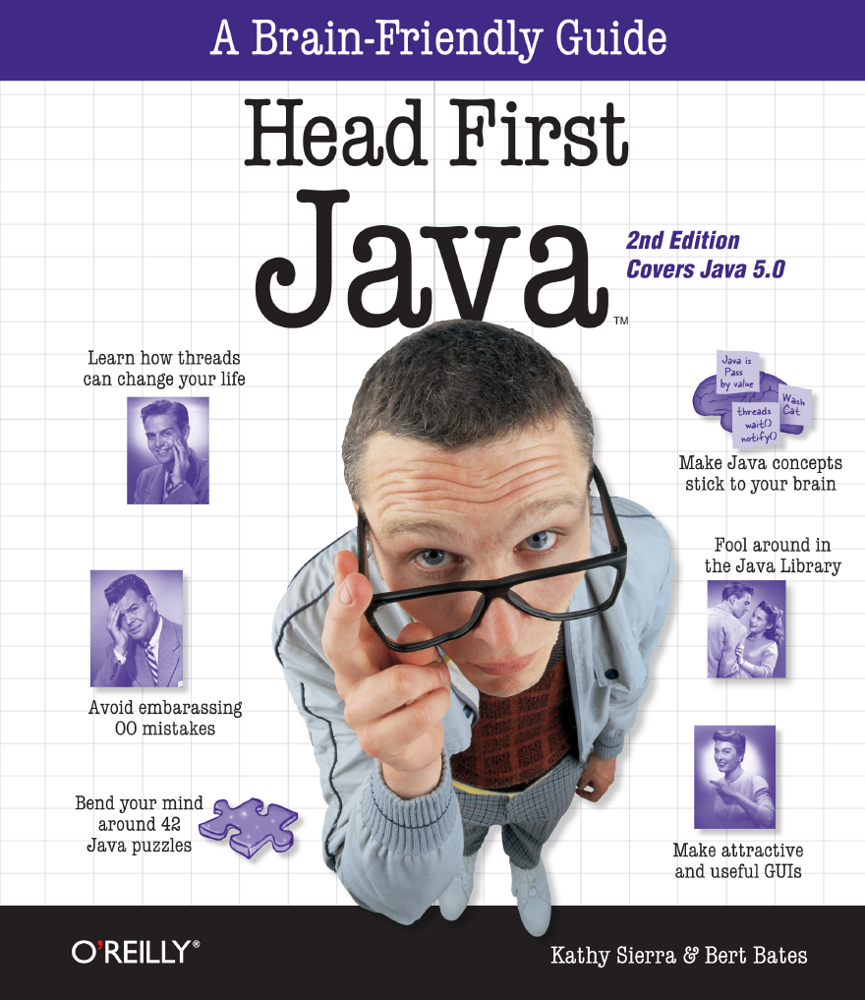
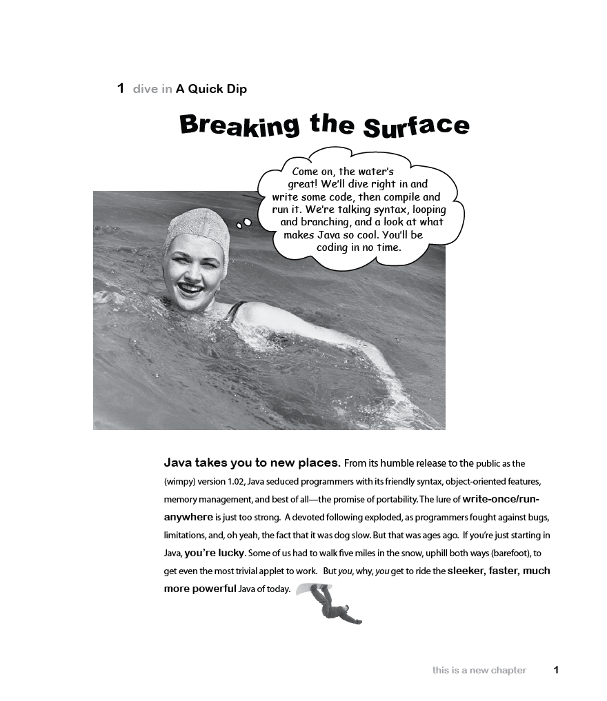
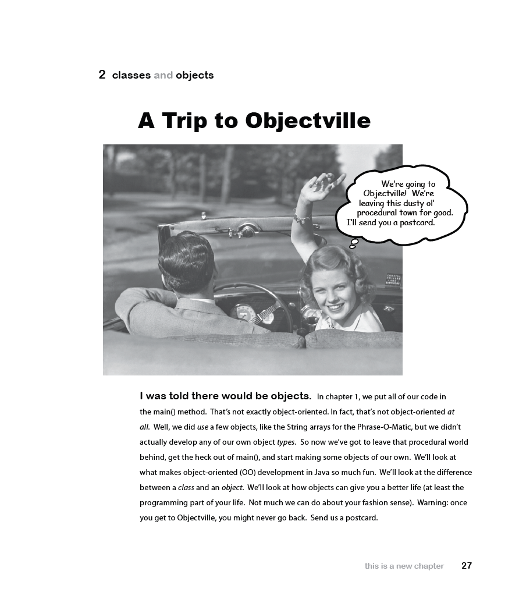
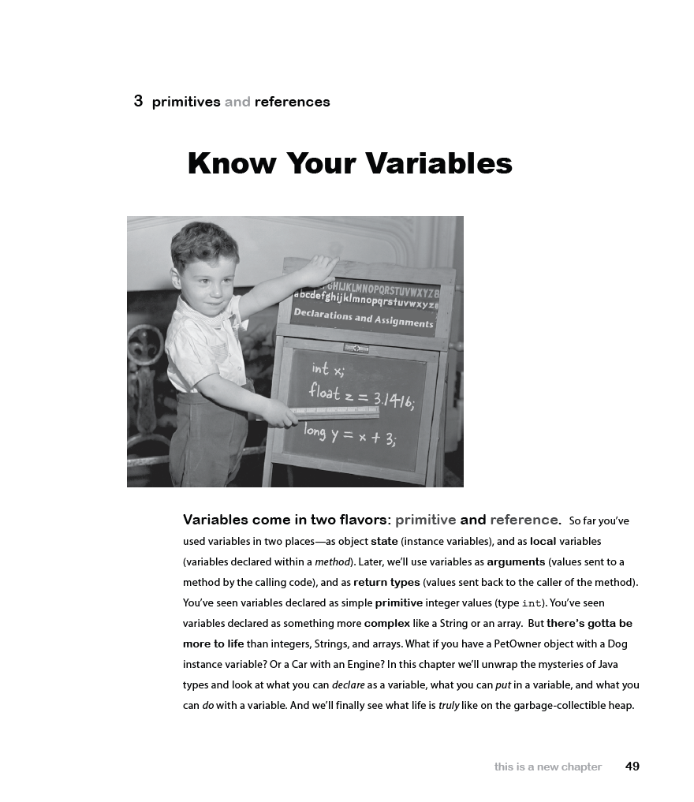
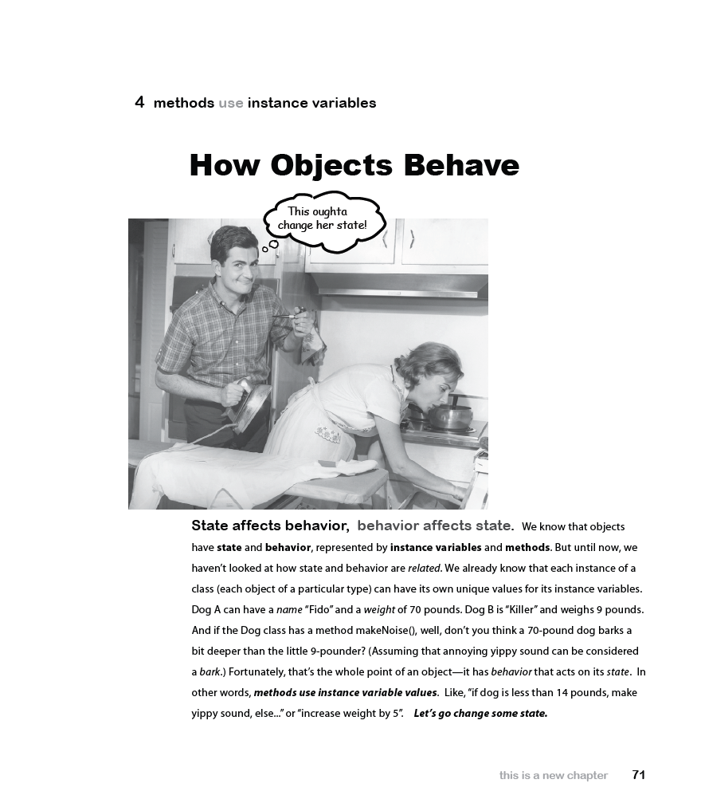
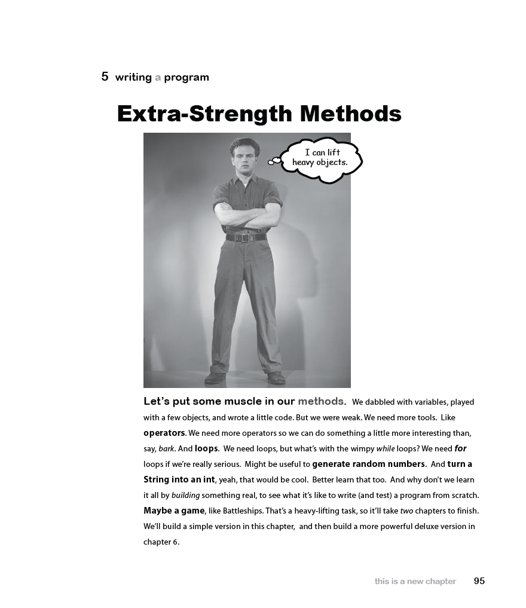

# Head First Java, Second Edition
*Kathy Sierra, Bert Bates (2005)*

---

## 📘 Chapter 1. Dive in A Quick Dip: Breaking the Surface

- 📂 Solutions are in folder: `chapter01`
- 📄 Exercises from the book:
    - Page 9 — Writing a class with a `main`
    - Page 12 — Example of a `while` loop
    - Page 13 — Conditional branching
    - Page 13 — Sharpen your pencil
    - Page 14 — Coding a Serious Business Application
    - Page 16–17 — Phrase-O-Matic
    - Page 20 — Code Magnets
    - Page 21 — BE the compiler
    - Page 23 — Mixed Messages
    - Page 24 — Pool Puzzle

---

## 📘 Chapter 2. Classes and Objects: A Trip to Objectville

- 📂 Solutions are in folder: `chapter02`
- 📄 Exercises from the book:
  - Page 36 — Making your first object
  - Page 37 — Making and testing Movie objects
  - Page 38–40 — The Guessing Game
  - Page 42 — BE the compiler
  - Page 43 — Code Magnets
  - Page 44 — Pool Puzzle

---

## 📘 Chapter 3. Primitives and References: Know Your Variables

- 📂 Solutions are in folder: `chapter03`
- 📄 Exercises from the book:
  - Page 62 — A Dog example
  - Page 63 — BE the compiler
  - Page 64 — Code Magnets
  - Page 65 — Pool Puzzle

---

## 📘 Chapter 4. Methods Use Instance Variables: How Objects Behave

- 📂 Solutions are in folder: `chapter04`
- 📄 Exercises from the book:
  - Page 73 — The size affects the bark
  - Page 79 — Cool things you can do with parameters and return types
  - Page 82 — Encapsulating the GoodDog class
  - Page 84 — Declaring and initializing instance variables
  - Page 88 — BE the compiler
  - Page 90 — Mixed Messages
  - Page 91 — Pool Puzzle

---

## 📘 Chapter 5. Writing a Program: Extra-Strength Methods

- 📂 Solutions are in folder: `chapter05`
- 📄 Exercises from the book:
  - Page 96–113 — Let’s build a Battleship-style game: "Sink a Dot Com"
  - Page 115 — Trips through a loop

