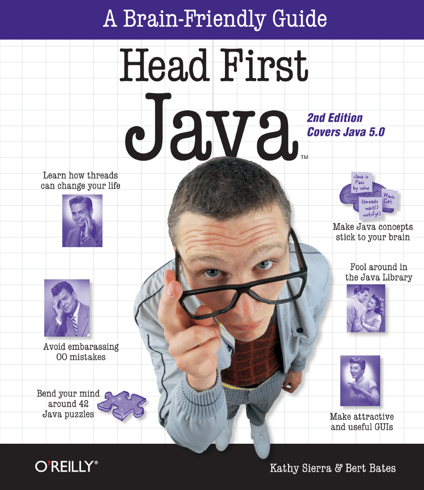
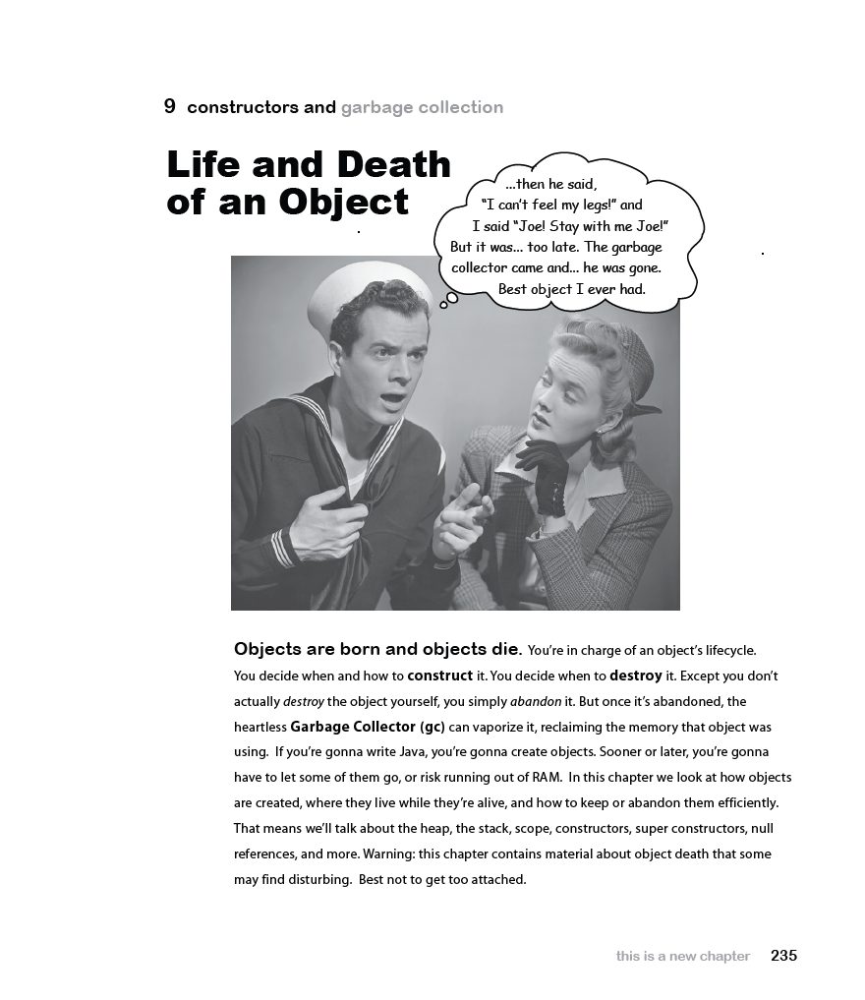

# Head First Java, Second Edition
*Kathy Sierra, Bert Bates (2005)*

---

## 📘 Chapter 1. Dive in A Quick Dip: Breaking the Surface

- 📂 Solutions are in folder: `com.headfirstjava.chapter01`
- 📄 Exercises from the book:
    - Page 9 — Writing a class with a `main`
    - Page 12 — Example of a `while` loop
    - Page 13 — Conditional branching
    - Page 13 — Sharpen your pencil
    - Page 14 — Coding a Serious Business Application
    - Page 16–17 — Phrase-O-Matic
    - Page 20 — Code Magnets
    - Page 21 — BE the compiler
    - Page 23 — Mixed Messages
    - Page 24 — Pool Puzzle

---

## 📘 Chapter 2. Classes and Objects: A Trip to Objectville

- 📂 Solutions are in folder: `com.headfirstjava.chapter02`
- 📄 Exercises from the book:
    - Page 36 — Making your first object 
    - Page 37 — Making and testing Movie objects 
    - Page 38–40 — The Guessing Game 
    - Page 42 — BE the compiler
    - Page 43 — Code Magnets 
    - Page 44 — Pool Puzzle

---

## 📘 Chapter 3. Primitives and References: Know Your Variables

- 📂 Solutions are in folder: `com.headfirstjava.chapter03`
- 📄 Exercises from the book:
    - Page 62 — A Dog example 
    - Page 63 — BE the compiler 
    - Page 64 — Code Magnets 
    - Page 65 — Pool Puzzle

---

## 📘 Chapter 4. Methods Use Instance Variables: How Objects Behave

- 📂 Solutions are in folder: `com.headfirstjava.chapter04`
- 📄 Exercises from the book:
    - Page 73 — The size affects the bark 
    - Page 79 — Cool things you can do with parameters and return types 
    - Page 82 — Encapsulating the GoodDog class 
    - Page 84 — Declaring and initializing instance variables 
    - Page 85 — The difference between instance and local variables 
    - Page 88 — BE the compiler 
    - Page 90 — Mixed Messages 
    - Page 91 — Pool Puzzle

---

## 📘 Chapter 5. Writing a Program: Extra-Strength Methods

- 📂 Solutions are in folder: `com.headfirstjava.chapter05`
- 📄 Exercises from the book:
    - Page 96–113 — Let’s build a Battleship-style game: “Sink a Dot Com”
    - Page 115 — Trips through a loop 
    - Page 118 — BE the JVM 
    - Page 119 — Code Magnets 
    - Page 121 — Mixed Messages

---

## 📘 Chapter 6. Get to Know The Java API: Using the Java Library

- 📂 Solutions are in folder: `com.headfirstjava.chapter06`
- 📄 Exercises from the book:
    - Page 138 — Let’s fix the DotCom code 
    - Page 139 — New and improved DotCom class 
    - Page 140–150, 152–153 — Let’s build the REAL game: “Sink a Dot Com”
    - Page 161 — Code Magnets

---

## 📘 Chapter 7. Inheritance and Polymorphism: Better Living in Objectville

- 📂 Solutions are in folder: `com.headfirstjava.chapter07`
- 📄 Exercises from the book:
    - Page 192 — Mixed Messages
    - Page 193 — BE the Compiler
    - Page 194 — Pool Puzzle

---

## 📘 Chapter 8. Interfaces and Abstract Classes: Serious Polymorphism

- 📂 Solutions are in folder: `com.headfirstjava.chapter08`
- 📄 Exercises from the book:
    - Page 206 — Polymorphism in action
    - Page 207 — Uh-oh, now we need to keep Cats, too
    - Page 209 — So what’s in this ultra-super-megaclass Object?
    - Page 232 — Pool Puzzle

---

## 📘 Chapter 9. Constructors and Garbage Collection: Life and Death of an Object

- 📂 Solutions are in folder: `com.headfirstjava.chapter09`
- 📄 Exercises from the book:
    - Page 242 — Construct a Duck
    - Page 243 — Initializing the state of a new Duck
    - Page 244 — Using the constructor to initialize important Duck state
    - Page 245 — Make it easy to make a Duck
    - Page 248 — Sharpen your pencil
    - Page 252 — Making a Hippo means making the Animal and Object parts too...
    - Page 255 — Superclass constructors with arguments
    - Page 257 — Sharpen your pencil
    - Page 266 — BE the Garbage Collector
    - Page 267 — Popular Objects
    - Page 268–269 — Five-Minute Mystery

---

## 📘 Chapter 10. Numbers and Statics: Numbers Matter

- 📂 Solutions are in folder: `com.headfirstjava.chapter10`
- 📄 Exercises from the book:
    - Page 277 — Static methods can’t use non-static (instance) variables!
    - Page 278 — Static methods can’t use non-static methods, either!
    - Page 279–280 — Static variable: value is the same for ALL instances of the class
    - Page 281 — Initializing a static variable
    - Page 282 — static final variables are constants
    - Page 283 — final isn’t just for static variables...
    - Page 285 — Sharpen your pencil
    - Page 291 — Sharpen your pencil
    - Page 294 — Number formatting
    - Page 307 — Even more Statics!... static imports
    - Page 310 — BE the compiler
    - Page 312 — Lunar Code Magnets

---

## 📘 Chapter 11. Exception Handling: Risky Behavior

- 📂 Solutions are in folder: `com.headfirstjava.chapter11`
- 📄 Exercises from the book:
    - Page 318 — First we need a Sequencer
    - Page 321 — The compiler needs to know that YOU know you’re calling a risky method.
    - Page 328 — Sharpen your pencil. Flow Control
    - Page 329 — Did we mention that a method can throw more than one exception?
    - Page 336 — Ducking (by declaring) only delays the inevitable
    - Page 342 — Your very first sound player app
    - Page 346 — Version 2: Using command-line args to experiment with sounds
    - Page 349 — Code Magnets

---

## 📘 Chapter 12. Getting GUI: A Very Graphic Story

- 📂 Solutions are in folder: `com.headfirstjava.chapter12`
- 📄 Exercises from the book:
    - Page 355 — Your first GUI: a button on a frame
    - Page 357–360 — Getting a user event
    - Page 364 — Make your own drawing widget
    - Page 365 — Fun things to do in paintComponent(). Display a JPEG
    - Page 365 — Fun things to do in paintComponent(). Paint a randomly-colored circle on a black background
    - Page 367 — Because life’s too short to paint the circle a solid color when there’s a gradient blend waiting for you.
    - Page 370–371 — GUI layouts: putting more than one widget on a frame
    - Page 376 — Inner class to the rescue!
    - Page 378–379 — How to make an instance of an inner class
    - Page 382–385 — Using an inner class for animation
    - Page 389 — Example: how to use the new static makeEvent() method
    - Page 390 — Version Two: registering and getting ControllerEvents
    - Page 391–393 — Version Three: drawing graphics in time with the music
    - Page 395 — BE the compiler
    - Page 396 — Pool Puzzle

---

## 📘 Chapter 13. Using Swing: Work on Your Swing

- 📂 Solutions are in folder: `com.headfirstjava.chapter13`
- 📄 Exercises from the book:
    - Page 403–411 — The Big Three layout managers: border, flow, and box.
    - Page 410 — Sharpen your pencil
    - Page 403–411 — The Big Three layout managers: border, flow, and box.
    - Page 413–417 — Playing with Swing components
    - Page 419–423 — Making the BeatBox
    - Page 424–425 — Which code goes with which layout?

---

## 📘 Chapter 14. Serialization and File I/O: Saving Objects

- 📂 Solutions are in folder: `com.headfirstjava.chapter14`
- 📄 Exercises from the book:
    - Page 437–439 — If you want your class to be serializable, implement Serializable
    - Page 444–445 — Saving and restoring the game characters
    - Page 447 — Writing a String to a Text File
    - Page 449–451 — Quiz Card Builder (code outline)
    - Page 454 — Reading from a Text File
    - Page 455–457 — Quiz Card Player (code outline)
    - Page 461 — Using the serialVersionUID
    - Page 463 — Saving a BeatBox pattern
    - Page 464 — Restoring a BeatBox pattern
    - Page 464 — Sharpen your pencil
    - Page 467 — Code Magnets

---

## 📘 Chapter 15. Networking and Threads: Make a Connection

- 📂 Solutions are in folder: `com.headfirstjava.chapter15`
- 📄 Exercises from the book:
    - Page 481 — DailyAdviceClient code
    - Page 484 — DailyAdviceServer code
    - Page 486–489 — Writing a Chat Client
    - Page 494–496 — To make a job for your thread, implement the Runnable interface
    - Page 497–499 — The Thread Scheduler
    - Page 502 — Using sleep to make our program more predictable.
    - Page 503 — Making and starting two threads
    - Page 506–509 — The Ryan and Monica problem, in code
    - Page 510 — We need the makeWithdrawal() method to run as one atomic thing.
    - Page 512 — The dreaded “Lost Update” problem
    - Page 514–515 — Make the increment() method atomic. Synchronize it!
    - Page 518–519 — New and improved SimpleChatClient
    - Page 524–525 — Code Magnets

---

## 📘 Chapter 16. Collections and Generics: Data Structures

- 📂 Solutions are in folder: `com.headfirstjava.chapter16`
- 📄 Exercises from the book:
    - Page 531 — Here’s what you have so far, without the sort:
    - Page 535 — Adding Collections.sort() to the Jukebox code
    - Page 536 — But now you need Song objects, not just simple Strings.
    - Page 537 — Changing the Jukebox code to use Songs instead of Strings
    - Page 550 — The new, improved, comparable Song class
    - Page 553 — Updating the Jukebox to use a Comparator
    - Page 554 — Sharpen your pencil. Reverse Engineer
    - Page 556 — Uh-oh. The sorting all works, but now we have duplicates...
    - Page 559 — Using a HashSet instead of ArrayList
    - Page 562 — The Song class with overridden hashCode() and equals()
    - Page 564 — And if we want the set to stay sorted, we’ve got TreeSet
    - Page 565 — What you MUST know about TreeSet...
    - Page 566 — TreeSet elements MUST be comparable
    - Page 567 — We’ve seen Lists and Sets, now we’ll use a Map
    - Page 568 — Finally, back to generics
    - Page 569 — Using polymorphic arguments and generics
    - Page 570 — But will it work with ArrayList<Dog> ?

---

## 📘 Chapter 17. Package, Jars and Deployment: Release Your Code

- 📂 Solutions are in folder: `com.headfirstjava.chapter17`
- 📄 Exercises from the book:
    - Page 584 — Separate source code and class files
    - Page 588–589 — Preventing package name conflicts

---

## 📘 Chapter 18. Remote Deployment with RMI: Distributed Computing

- 📂 Solutions are in folder: `com.headfirstjava.chapter18`
- 📄 Exercises from the book:
    - Page 614–619 — Java RMI gives you the client and service helper objects!
    - Page 621 — How does the client get the stub class?
    - Page 625–628 — What about Servlets?
    - Page 629–630 — Just for fun, let’s make the Phrase-O-Matic work as a servlet
    - Page 636–647 — Final Project: the Universal Service browser
    - Page 644 — Sharpen your pencil

---

## 📘 Appendix A. Final Code Kitchen

- 📂 Solutions are in folder: `com.headfirstjava.appendix.a`
- 📄 Exercises from the book:
    - Page 650–656 — Final BeatBox client program

