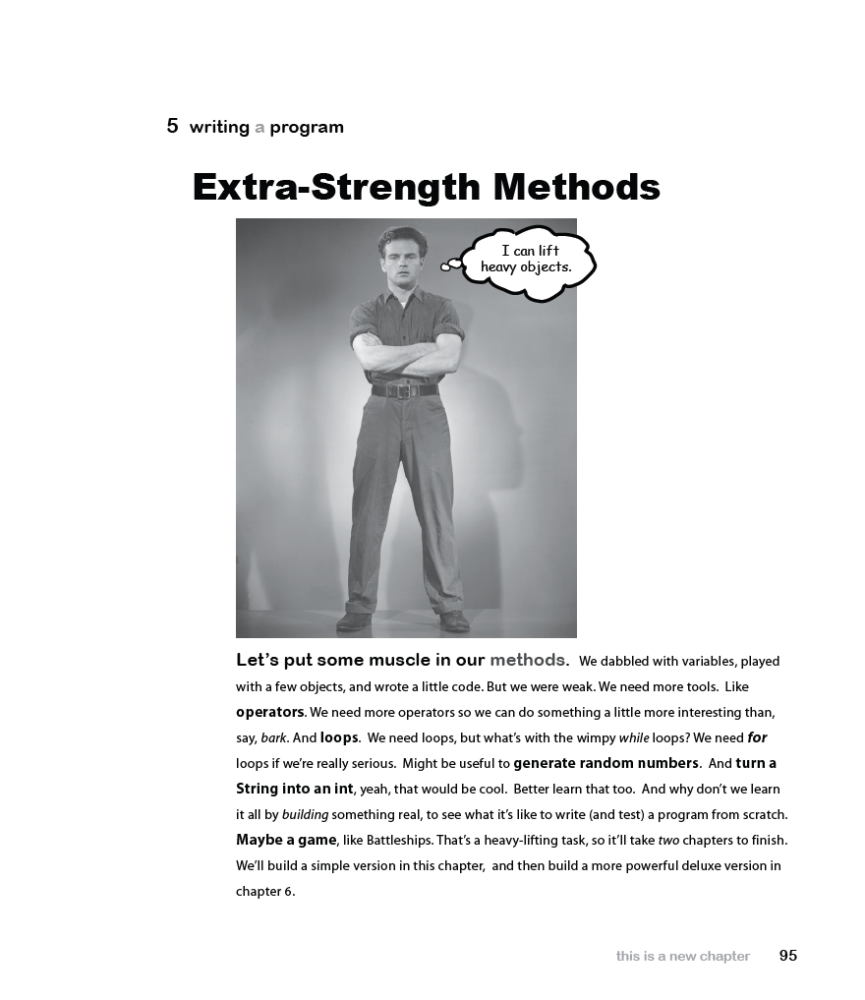

# Head First Java, Second Edition
*Kathy Sierra, Bert Bates (2005)*

---

## 📘 Chapter 1. Dive in A Quick Dip: Breaking the Surface

- 📂 Solutions are in folder: `chapter01`
- 📄 Exercises from the book:
    - Page 9 — Writing a class with a `main`
    - Page 12 — Example of a `while` loop
    - Page 13 — Conditional branching
    - Page 13 — Sharpen your pencil
    - Page 14 — Coding a Serious Business Application
    - Page 16–17 — Phrase-O-Matic
    - Page 20 — Code Magnets
    - Page 21 — BE the compiler
    - Page 23 — Mixed Messages
    - Page 24 — Pool Puzzle

---

## 📘 Chapter 2. Classes and Objects: A Trip to Objectville

- 📂 Solutions are in folder: `chapter02`
- 📄 Exercises from the book:
    - Page 36 — Making your first object 
    - Page 37 — Making and testing Movie objects 
    - Page 38–40 — The Guessing Game 
    - Page 42 — BE the compiler
    - Page 43 — Code Magnets 
    - Page 44 — Pool Puzzle

---

## 📘 Chapter 3. Primitives and References: Know Your Variables

- 📂 Solutions are in folder: `chapter03`
- 📄 Exercises from the book:
    - Page 62 — A Dog example 
    - Page 63 — BE the compiler 
    - Page 64 — Code Magnets 
    - Page 65 — Pool Puzzle

---

## 📘 Chapter 4. Methods Use Instance Variables: How Objects Behave

- 📂 Solutions are in folder: `chapter04`
- 📄 Exercises from the book:
    - Page 73 — The size affects the bark 
    - Page 79 — Cool things you can do with parameters and return types 
    - Page 82 — Encapsulating the GoodDog class 
    - Page 84 — Declaring and initializing instance variables 
    - Page 85 — The difference between instance and local variables 
    - Page 88 — BE the compiler 
    - Page 90 — Mixed Messages 
    - Page 91 — Pool Puzzle

---

## 📘 Chapter 5. Writing a Program: Extra-Strength Methods

- 📂 Solutions are in folder: `chapter05`
- 📄 Exercises from the book:
    - Page 96–113 — Let’s build a Battleship-style game: “Sink a Dot Com”
    - Page 115 — Trips through a loop 
    - Page 118 — BE the JVM 
    - Page 119 — Code Magnets 
    - Page 121 — Mixed Messages

---

## 📘 Chapter 6. Get to Know The Java API: Using the Java Library

- 📂 Solutions are in folder: `chapter06`
- 📄 Exercises from the book:
    - Page 138 — Let’s fix the DotCom code 
    - Page 139 — New and improved DotCom class 
    - Page 140–150, 152–153 — Let’s build the REAL game: “Sink a Dot Com”
    - Page 161 — Code Magnets

---

## 📘 Chapter 7. Inheritance and Polymorphism: Better Living in Objectville

- 📂 Solutions are in folder: `chapter07`
- 📄 Exercises from the book:
    - Page 192 — Mixed Messages
    - Page 193 — BE the Compiler
    - Page 194 — Pool Puzzle

---

## 📘 Chapter 8. Interfaces and Abstract Classes: Serious Polymorphism

- 📂 Solutions are in folder: `chapter08`
- 📄 Exercises from the book:
    - Page 206 — Polymorphism in action
    - Page 207 — Uh-oh, now we need to keep Cats, too
    - Page 209 — So what’s in this ultra-super-megaclass Object?
    - Page 232 — Pool Puzzle

---

## 📘 Chapter 9. Constructors and Garbage Collection: Life and Death of an Object

- 📂 Solutions are in folder: `chapter09`
- 📄 Exercises from the book:
    - Page 242 — Construct a Duck
    - Page 243 — Initializing the state of a new Duck
    - Page 244 — Using the constructor to initialize important Duck state
    - Page 245 — Make it easy to make a Duck
    - Page 248 — Sharpen your pencil
    - Page 252 — Making a Hippo means making the Animal and Object parts too...
    - Page 255 — Superclass constructors with arguments
    - Page 257 — Sharpen your pencil
    - Page 266 — BE the Garbage Collector
    - Page 267 — Popular Objects
    - Page 268–269 — Five-Minute Mystery

---

## 📘 Chapter 10. Numbers and Statics: Numbers Matter

- 📂 Solutions are in folder: `chapter10`
- 📄 Exercises from the book:
    - Page 277 — Static methods can’t use non-static (instance) variables!
    - Page 278 — Static methods can’t use non-static methods, either!
    - Page 279–280 — Static variable: value is the same for ALL instances of the class
    - Page 281 — Initializing a static variable
    - Page 282 — static final variables are constants
    - Page 283 — final isn’t just for static variables...
    - Page 285 — Sharpen your pencil
    - Page 291 — Sharpen your pencil
    - Page 294 — Number formatting
    - Page 307 — Even more Statics!... static imports
    - Page 310 — BE the compiler
    - Page 312 — Lunar Code Magnets

---

## 📘 Chapter 11. Exception Handling: Risky Behavior

- 📂 Solutions are in folder: `chapter11`
- 📄 Exercises from the book:
    - Page 318 — First we need a Sequencer
    - Page 321 — The compiler needs to know that YOU know you’re calling a risky method.
    - Page 328 — Sharpen your pencil. Flow Control
    - Page 329 — Did we mention that a method can throw more than one exception?

